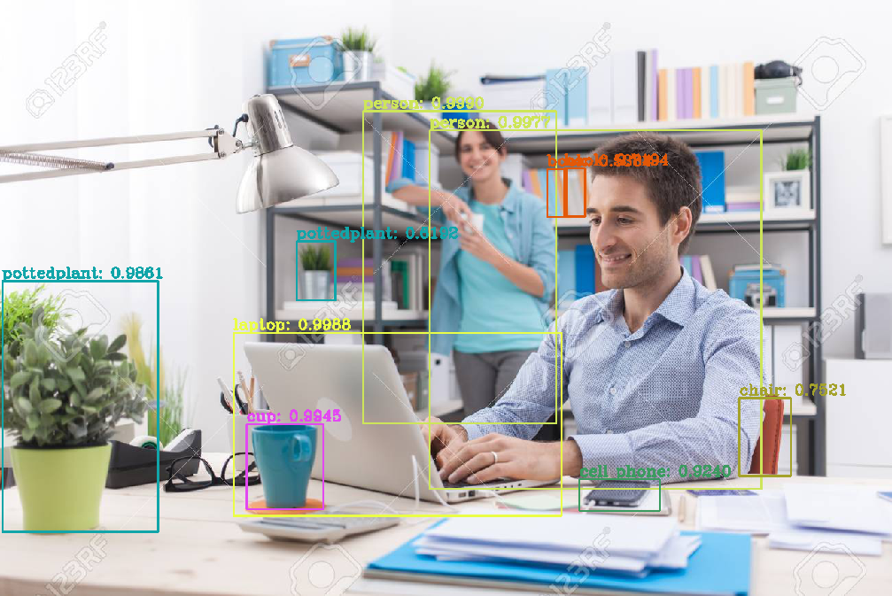
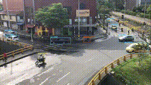

## RECONOCER OBJETOS EN IMAGEN/VIDEO/CAMARA USANDO YOLOV3/V4 CON OPENCV
  


Reconocer objetos usando la librería OpenCV
## YOLOV3 / YOLOV4 🚀
_Reconocer objetos en imagen/video/camara con OpenCV deep learning library, utilizando dnn, y darknet framework.
Es necesario descargar los pesos para cada versión de YOLO.
* [yolov3.weights](https://pjreddie.com/darknet/yolo) - Descargar yolo.weights
* [yolov4.weights](https://drive.google.com/file/d/1-_-Nwz1RwQqZglKqg-E-04lhWM1RvsaN/view?usp=sharing) - Archivo en drive
### Requisitos📋
```
Python
```
```
Anaconda(recomendado)
```
```
OpenCV
```
```
Numpy
```
### Instalación 🔧
_Poner los pesos en la carpeta yolo-coco-data_

### Descargar Anaconda
```
* [Anaconda](https://www.anaconda.com/products/individual) - Descargar anaconda
```
### Abrir Anaconda Prompt
_Crear un ambiente virtual_
```
conda create --name go_ahead_env
```
### Activar el ambiente
```
conda activate go_ahead_env
```
### Instalar las librerias necesarias
```
conda install -c conda-forge opencv
```
```
conda install -c anaconda numpy
```
### Configurar path de pesos y configuracion
_Para correr Yolov3 abrir el script yolo_image.py y modificar path en la linea 56_
```
network = cv2.dnn.readNetFromDarknet('yolo-coco-data/yolov3.cfg','yolo-coco-data/yolov3.weights')
```
_Para correr Yolov4 abrir el script yolo_image.py y modificar path en la linea 56_
```
network = cv2.dnn.readNetFromDarknet('yolo-coco-data/yolov4.cfg', 'yolo-coco-data/yolov4.weights')
```
### Correr el detector imagenes yolo_image.py en anaconda prompt
_navegar hasta la carpeta yolo-opencv y correr el script:_
```
python yolo_image.py
```
### Detectar objetos en otras imagenes
_Poner la imagen de interes en la carpeta images_
_Abrir en algun editor el script yolo_image.py y configurar el path en la linea 26_
```
imagen_BGR = cv2.imread('images/nombre_imagen.jpg')
```
_Guardar cambios y correr el script en anaconda prompt_
```
python yolo_image.py
```
### Detectar objetos en video
```
python yolo-3-video.py
```
_Por defecto detectará objetos en el archivo overpass.mp4 ubicado en la carpeta videos
para detectar objetos en otro video, añadirlo a la carpeta videos y configurar path en la linea 28_
```
video = cv2.VideoCapture('videos/name_video.mp4')
```
_Configurar el path de los pesos según la versión de Yolo a utilizar_

### ¿Cuál versión de yolo funcionó mejor para tu proyecto?

_GOOD LUCK! Creado por jgomeher83 para go_ahead_

### Documentacion oficial
* [OpenCV](https://opencv.org/) - OpenCv
* [YOLO](https://pjreddie.com/darknet/yolo/) - Pagina oficial de yolo y darknet
